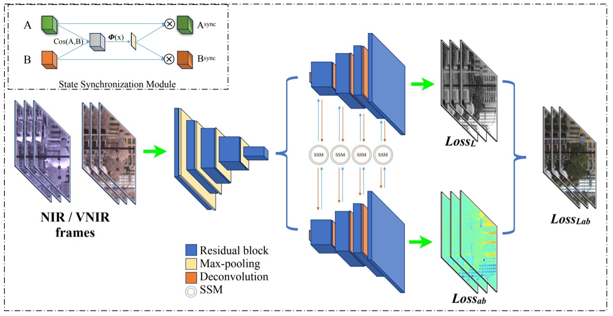

# Infrared Image Colorization
By Hyeongyu Kim

Department of Electrical and Computer Engineering at SungKyunKwan University in the M.S Course.

This is a Pytorch implementation of Infrared Image Colorization Using Neural Networks. This repository includes the implementation of ["Learn to 
Recover Visible Color for Video Surveillance in a Day"](https://www.ecva.net/papers/eccv_2020/papers_ECCV/papers/123460477.pdf) as well, so that you can train and compare among base CNN model.

## Abstract
In the conventional near-infrared image colorization methods, color consistency is reduced, texture is damaged, and artifacts occur. In particular, in the method using Generative Adversarial Networks (GAN), the quantitative value is calculated high, but the problem of image distortion occurs. To solve this problem, we propose a feature fusion module using a multi-scale channel attention module (MS-CAM) that extracts edges using Canny filter and fuses two color images with feature maps. The proposed method improves the PSNR value of NIR2VC compared to the existing method in the VSIAD (Video surveillance in a day) dataset with two types of data, VNIR2VC and NIR2VC. This satisfies the purpose required in this paper and contributes to performance improvement. Qualitatively, the result has an excellent ability to capture the consistency of the building exterior wall color and texture components such as wood, which has an excellent effect in urban areas with dense buildings or natural images. In addition, the proposed method can also be applied to the field of nighttime activities and monitoring such as CCTV and military facilities, as well as thermal imaging cameras with properties similar to near-infrared rays. For future research, research on artifact improvement methods, performance improvement using GAN and model compression should be conducted.

## Diagram of Models

